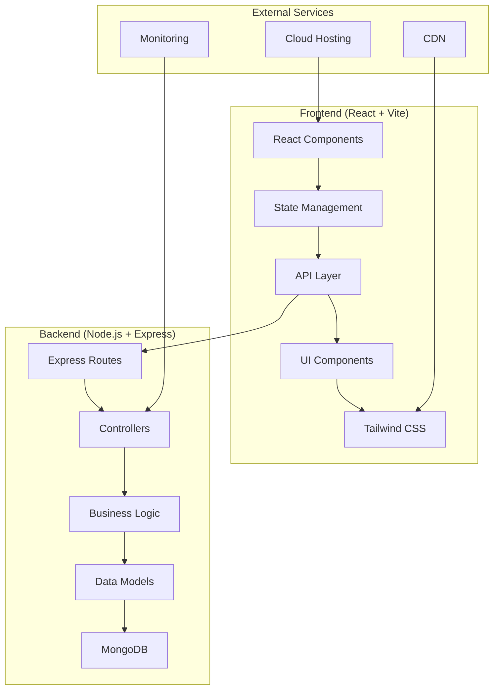
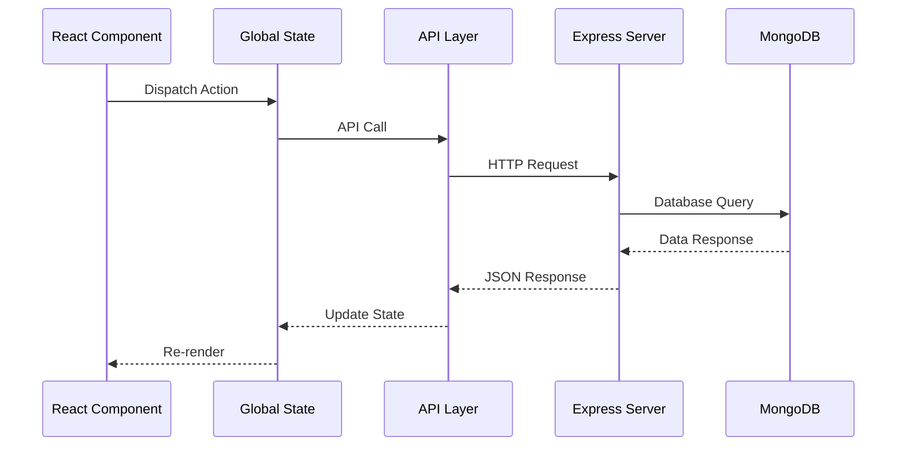

# Design Document

## Overview

This design document outlines the architecture and implementation approach for completing the Ascenda self-growth platform. The application will evolve from its current MVP state to a comprehensive habit tracking system with advanced analytics, responsive design, and production deployment capabilities.

The design focuses on enhancing the existing MERN stack foundation while introducing modern state management, data visualization, and user experience improvements. Key emphasis is placed on educational value for college-level learning, demonstrating industry best practices in React development, Tailwind CSS mastery, and full-stack integration patterns.

## Architecture

### High-Level Architecture



### Technology Stack Enhancement

**Frontend Additions:**
- **State Management**: Context API with useReducer for global state
- **Data Visualization**: Recharts for analytics and progress charts
- **UI Enhancement**: Extended Tailwind CSS patterns and custom components
- **Performance**: React.memo, useMemo, and useCallback optimizations

**Backend Enhancements:**
- **Data Aggregation**: MongoDB aggregation pipelines for analytics
- **Caching**: In-memory caching for frequently accessed data
- **Validation**: Enhanced input validation and sanitization
- **Error Handling**: Comprehensive error handling and logging

## Components and Interfaces

### Frontend Component Architecture

#### Core Components

**1. Enhanced Dashboard Component**
```javascript
// Dashboard with real-time data and analytics
const Dashboard = () => {
  // State management for goals, stats, and user data
  // Real-time updates and optimistic UI updates
  // Responsive grid layout with Tailwind
}
```

**2. Analytics Component**
```javascript
// New component for detailed progress visualization
const Analytics = () => {
  // Chart.js integration for progress tracking
  // Time-based filtering (daily, weekly, monthly)
  // Goal completion trends and insights
}
```

**3. Goal Management Components**
```javascript
// Enhanced goal creation and editing
const GoalManager = () => {
  // Category management
  // Priority levels and scheduling
  // Template system for common goals
}
```

**4. Profile Management Component**
```javascript
// User profile and settings
const Profile = () => {
  // Profile picture upload
  // Account settings and preferences
  // Data export functionality
}
```

#### State Management Architecture

**Global State Structure:**
```javascript
const AppState = {
  user: {
    profile: UserProfile,
    preferences: UserPreferences,
    isAuthenticated: boolean
  },
  goals: {
    today: Goal[],
    categories: Category[],
    templates: GoalTemplate[]
  },
  analytics: {
    streaks: StreakData,
    completionRates: CompletionData,
    insights: InsightData
  },
  ui: {
    loading: LoadingState,
    errors: ErrorState,
    notifications: NotificationState
  }
}
```

### Backend API Enhancements

#### New API Endpoints

**Analytics Endpoints:**
- `GET /api/analytics/streaks` - Get streak data for all goals
- `GET /api/analytics/trends` - Get completion trends over time
- `GET /api/analytics/insights` - Get AI-generated insights

**Enhanced Goal Endpoints:**
- `POST /api/goals/categories` - Create goal categories
- `GET /api/goals/templates` - Get goal templates
- `PATCH /api/goals/bulk` - Bulk update goals

**Profile Management:**
- `PATCH /api/user/profile` - Update user profile
- `POST /api/user/avatar` - Upload profile picture
- `GET /api/user/export` - Export user data

#### Data Flow Architecture



## Data Models

### Enhanced Data Models

#### User Model Extensions
```javascript
const userSchema = {
  // Existing fields...
  preferences: {
    theme: { type: String, enum: ['light', 'dark'], default: 'dark' },
    notifications: {
      daily: { type: Boolean, default: true },
      weekly: { type: Boolean, default: true },
      achievements: { type: Boolean, default: true }
    },
    dashboard: {
      layout: { type: String, enum: ['compact', 'detailed'], default: 'detailed' },
      defaultView: { type: String, enum: ['today', 'week', 'analytics'], default: 'today' }
    }
  },
  stats: {
    totalGoalsCreated: { type: Number, default: 0 },
    totalGoalsCompleted: { type: Number, default: 0 },
    longestStreak: { type: Number, default: 0 },
    currentStreak: { type: Number, default: 0 },
    joinDate: { type: Date, default: Date.now }
  }
}
```

#### Goal Model Extensions
```javascript
const goalSchema = {
  // Existing fields...
  category: {
    type: mongoose.Schema.Types.ObjectId,
    ref: 'Category',
    required: false
  },
  priority: {
    type: String,
    enum: ['low', 'medium', 'high'],
    default: 'medium'
  },
  streak: {
    current: { type: Number, default: 0 },
    longest: { type: Number, default: 0 },
    lastCompleted: { type: Date }
  },
  frequency: {
    type: String,
    enum: ['daily', 'weekly', 'custom'],
    default: 'daily'
  },
  tags: [{ type: String, trim: true }],
  isTemplate: { type: Boolean, default: false }
}
```

#### New Models

**Category Model:**
```javascript
const categorySchema = {
  name: { type: String, required: true, trim: true },
  color: { type: String, required: true }, // Hex color code
  icon: { type: String, required: true }, // Icon identifier
  user: { type: mongoose.Schema.Types.ObjectId, ref: 'User', required: true },
  goalCount: { type: Number, default: 0 }
}
```

**Analytics Model:**
```javascript
const analyticsSchema = {
  user: { type: mongoose.Schema.Types.ObjectId, ref: 'User', required: true },
  date: { type: Date, required: true },
  metrics: {
    goalsCompleted: { type: Number, default: 0 },
    goalsCreated: { type: Number, default: 0 },
    completionRate: { type: Number, default: 0 },
    focusScore: { type: Number, default: 0 }
  },
  streaks: [{
    goalId: { type: mongoose.Schema.Types.ObjectId, ref: 'Goal' },
    streakLength: { type: Number, default: 0 }
  }]
}
```

## Correctness Properties

*A property is a characteristic or behavior that should hold true across all valid executions of a system—essentially, a formal statement about what the system should do. Properties serve as the bridge between human-readable specifications and machine-verifiable correctness guarantees.*

Before defining the correctness properties, I need to analyze the acceptance criteria from the requirements to determine which ones are testable as properties.

<function_calls>
<invoke name="prework">
<parameter name="featureName">ascenda-completion

### Property Reflection

After analyzing all acceptance criteria, I identified several areas where properties can be consolidated to eliminate redundancy:

**Consolidation Areas:**
- Properties 1.1, 1.2, and 1.5 can be combined into a comprehensive goal management property
- Properties 2.1 and 2.2 can be combined into a single streak calculation property
- Properties 4.1, 4.2, and 4.4 can be combined into a comprehensive responsive design property
- Properties 6.1, 6.2, and 6.5 can be combined into a state management consistency property
- Properties 9.1, 9.2, and 9.5 can be combined into a code quality demonstration property
- Properties 10.1, 10.2, and 10.3 can be combined into a comprehensive code quality property

This consolidation ensures each property provides unique validation value while avoiding redundant testing.

### Correctness Properties

Based on the prework analysis, here are the key correctness properties that will validate the system's behavior:

**Property 1: Goal Management Consistency**
*For any* goal creation or modification operation, the system should correctly store all specified attributes (category, priority, frequency) and make them retrievable through the display interface with proper organization and visual indicators.
**Validates: Requirements 1.1, 1.2, 1.5**

**Property 2: Streak Calculation Accuracy**
*For any* sequence of goal completions and breaks, the system should correctly calculate current streaks, preserve longest streaks when broken, and reset current streaks appropriately.
**Validates: Requirements 2.1, 2.2**

**Property 3: Achievement Milestone Detection**
*For any* goal completion that reaches a streak milestone, the system should generate appropriate achievement badges and notifications.
**Validates: Requirements 2.3**

**Property 4: Consistency Score Calculation**
*For any* set of goal completion patterns, the system should calculate a consistent and accurate overall consistency score based on the completion data.
**Validates: Requirements 2.4**

**Property 5: Data Visualization Accuracy**
*For any* streak or analytics data, the visual representations should accurately reflect the underlying data patterns and respond correctly to filtering operations.
**Validates: Requirements 2.5, 3.1, 3.2**

**Property 6: Analytics Data Aggregation**
*For any* time period (daily, weekly, monthly), the analytics system should correctly aggregate completion data and identify the most and least consistent goals.
**Validates: Requirements 3.3, 3.4**

**Property 7: Data Export Completeness**
*For any* user data export operation, the exported data should be complete, properly formatted, and include all user progress information.
**Validates: Requirements 3.5**

**Property 8: Responsive Design Consistency**
*For any* viewport size (mobile, tablet, desktop), the interface should adapt appropriately while maintaining consistent functionality and touch-friendly interactions.
**Validates: Requirements 4.1, 4.2, 4.3, 4.4**

**Property 9: Progressive Loading Behavior**
*For any* network condition, the system should implement progressive loading and provide appropriate offline capabilities.
**Validates: Requirements 4.5**

**Property 10: Profile Management Integrity**
*For any* profile update operation, changes should be saved correctly and applied throughout the application interface.
**Validates: Requirements 5.1, 5.3**

**Property 11: Security Validation Consistency**
*For any* security-related operation (password changes, authentication), the system should enforce proper validation and security standards.
**Validates: Requirements 5.2, 5.5**

**Property 12: Data Portability and Deletion**
*For any* data export or account deletion request, the system should handle user data appropriately and completely.
**Validates: Requirements 5.4**

**Property 13: State Management Consistency**
*For any* user interaction or navigation, the system should maintain consistent state across all components and preserve authentication context.
**Validates: Requirements 6.1, 6.2, 6.5**

**Property 14: Error Handling Robustness**
*For any* network error or invalid input, the system should provide graceful error handling and appropriate user feedback.
**Validates: Requirements 6.3, 6.4**

**Property 15: Performance Standards Compliance**
*For any* page load or user interaction, the system should meet performance standards (2-second load times, immediate feedback, optimized rendering).
**Validates: Requirements 7.1, 7.2, 7.3**

**Property 16: Build Optimization Effectiveness**
*For any* production build, the system should implement code splitting and bundle size optimization.
**Validates: Requirements 7.4**

**Property 17: Form Validation Responsiveness**
*For any* form interaction, the system should provide real-time validation and helpful error messages.
**Validates: Requirements 7.5**

**Property 18: Security Configuration Compliance**
*For any* production deployment, the system should enforce HTTPS and include proper security headers.
**Validates: Requirements 8.2**

**Property 19: Monitoring and Logging Completeness**
*For any* system operation, appropriate logs should be generated and monitoring data should be captured.
**Validates: Requirements 8.3**

**Property 20: Environment Configuration Correctness**
*For any* deployment environment, the system should use appropriate configuration settings.
**Validates: Requirements 8.4**

**Property 21: Code Quality Demonstration**
*For any* implemented feature, the code should demonstrate modern React patterns, Tailwind CSS best practices, and proper integration techniques.
**Validates: Requirements 9.1, 9.2, 9.5**

**Property 22: Documentation Completeness**
*For any* key component or design decision, appropriate code comments and documentation should be present.
**Validates: Requirements 9.4**

**Property 23: Code Standards Compliance**
*For any* code file, it should follow consistent coding standards, include proper error handling, and maintain clear separation of concerns.
**Validates: Requirements 10.1, 10.2, 10.3**

**Property 24: Security Implementation Thoroughness**
*For any* user input or authentication point, proper security measures including sanitization and protection should be implemented.
**Validates: Requirements 10.4**

**Property 25: Configuration Management Consistency**
*For any* deployment, environment variables should be properly managed and configured.
**Validates: Requirements 10.5**

## Error Handling

### Frontend Error Handling Strategy

**1. API Error Handling**
- Implement centralized error handling for all API calls
- Provide user-friendly error messages for common scenarios
- Implement retry logic for transient failures
- Show appropriate loading states during operations

**2. Form Validation**
- Real-time validation with immediate feedback
- Client-side validation for user experience
- Server-side validation for security
- Clear error messaging with actionable guidance

**3. Network Error Handling**
- Offline detection and appropriate messaging
- Graceful degradation when services are unavailable
- Retry mechanisms for failed requests
- Progress indicators for long-running operations

### Backend Error Handling Strategy

**1. Input Validation**
- Comprehensive validation using Joi or similar library
- Sanitization of all user inputs
- Type checking and format validation
- Rate limiting to prevent abuse

**2. Database Error Handling**
- Connection error recovery
- Transaction rollback on failures
- Proper error logging and monitoring
- Graceful handling of constraint violations

**3. Authentication and Authorization**
- JWT token validation and refresh
- Session management and cleanup
- Proper error responses for unauthorized access
- Security logging for audit trails

## Testing Strategy

### Dual Testing Approach

The testing strategy combines unit testing and property-based testing to ensure comprehensive coverage:

**Unit Testing Focus:**
- Specific examples and edge cases
- Integration points between components
- Error conditions and boundary cases
- User interface interactions and accessibility

**Property-Based Testing Focus:**
- Universal properties across all inputs
- Data integrity and consistency validation
- Business logic correctness
- Performance characteristics under load

### Property-Based Testing Configuration

**Library Selection:** For JavaScript/React applications, we'll use `fast-check` for property-based testing, which provides excellent integration with Jest and supports complex data generation.

**Test Configuration:**
- Minimum 100 iterations per property test
- Each property test references its corresponding design document property
- Tag format: **Feature: ascenda-completion, Property {number}: {property_text}**

**Example Property Test Structure:**
```javascript
// Feature: ascenda-completion, Property 1: Goal Management Consistency
test('goal creation and retrieval consistency', () => {
  fc.assert(fc.property(
    goalDataGenerator,
    (goalData) => {
      const createdGoal = createGoal(goalData);
      const retrievedGoal = getGoal(createdGoal.id);
      
      expect(retrievedGoal.category).toBe(goalData.category);
      expect(retrievedGoal.priority).toBe(goalData.priority);
      expect(retrievedGoal.frequency).toBe(goalData.frequency);
    }
  ), { numRuns: 100 });
});
```

### Testing Implementation Requirements

**Unit Test Coverage:**
- Component rendering and interaction testing with React Testing Library
- API endpoint testing with supertest
- Database model validation testing
- Authentication and authorization flow testing

**Property Test Coverage:**
- Each of the 25 correctness properties must be implemented as property-based tests
- Data generators for goals, users, categories, and analytics data
- State consistency testing across component interactions
- Performance property validation for load times and responsiveness

**Integration Testing:**
- End-to-end user workflows
- API integration testing
- Database transaction testing
- Authentication flow testing

This comprehensive testing approach ensures both specific functionality works correctly (unit tests) and that the system maintains correctness across all possible inputs and scenarios (property tests).